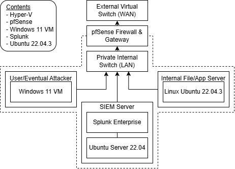

02-01-26 Network Topology Overview

- I made this quick diagram using Draw.io, it was a way for me to visualize the network I am about to create. The best way to understand this I believe is to explain what's going on. Expanding on these principles and new ones will come later, this is just my first step.

- The dashed line that surrounds the Private Internal Switch (LAN), User/Eventual Attacker, SIEM Server and Internal File/App Server are all a part of the Trusted Internal Box, pfSense Firewall & Gateway is not completely inside or outside the line because its Boundary Enforcement.

- I plan on testing my network by having a legitimate account sign into the server and get the file "Salmiakki.png", then with Nmap and other tools possibly seeing if there are any flaws to my first network project and seeing if I can obtain the image again. For my project here, I will use Linux for Splunk to run the SIEM server.
